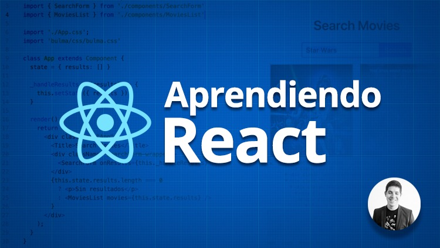

**¿Por qué todo el mundo está aprendiendo React JS?** ¿Qué es lo que tiene que hace que hayan tanto recruiters buscando desarrolladores de esta librería? En esta lista te doy cinco razones por las que deberías aprenderlo, si no lo has hecho ya.

**1. Una API sencilla, una potencia brutal:** Aprender React es más fácil de lo que parece si ya tienes unas bases de programación y Javascript. Suele costar más el cambio de mentalidad (pasar de una programación imperativa a una declarativa) que aprender como usar su API. En el primer día ya estarás creando componentes.

**2. Una librería contrastada:** React no es una moda pasajera, de hecho fue creada en el año 2013. Hoy en día algunas de las compañías más punteras en tecnología como Facebook, Instagram, Netflix, Paypal, Apple, Twitter o Fotocasa la están usando en producción. ¡Échale un ojo a la lista completa!

**3. Una comunidad enorme, un ecosistema gigantesco:** React ha conseguido aglutinar mucho amor y cariño por parte de la comunidad de desarrollo. Además de todos los tutoriales, cursos de React y artículos hablando sobre ella, también existen multitud de proyectos y componentes que se integran con ella. Hay un catálogo de posibilidades enorme.

**4. Aprende una vez, úsalo en todos lados:** Una de las mayores bazas de React es que no la librería no está acoplado al navegador. ¿Qué quiere decir esto? Pues que si aprendes los mecanismos y la API de React, no sólo podrás usar ReactJS para hacer páginas web, si no que podrías usar React Native para crear aplicaciones móviles. O React VR para crear experiencias de realidad virtual. Brutal, ¿verdad?

**5. Considerada la tecnología para perfiles de frontend mejor pagada** (según la última encuesta de Stack Overflow) y una demanda enorme de desarrolladores de React en todo el mundo. Solo hace falta ver la cantidad de recruitment que buscan perfiles con conocimientos de React en LinkedIn.

**¿Estás decidido ya? ¿Buscas un sitio donde aprender?** Pues puedes empezar a aprender React con mi curso de Udemy que, por tiempo limitado, tiene un descuento del 60% quedándose en 19'99€.

